# 🧠 Mental Math Challenge

> A high-quality collection of 20+ brain games designed to challenge your speed, memory, concentration, calculation, and logical thinking.

---

## 🎮 About The Game

**Mental Math Challenge** is a collection of **20+ brain games and mental challenges** created to test and improve different cognitive skills.

The game includes challenges focused on:

- 🧠 Memory
- ⚡ Reaction speed
- 🎯 Accuracy
- 🔢 Mathematical thinking
- 👀 Concentration
- 🧩 Logic
- ⏱️ Speed and time management

The goal is to create a polished and enjoyable collection of brain games with high-quality visuals, smooth animations, sound effects, and responsive gameplay.

---

# 🚀 GAME DEVELOP PROCESS🙂

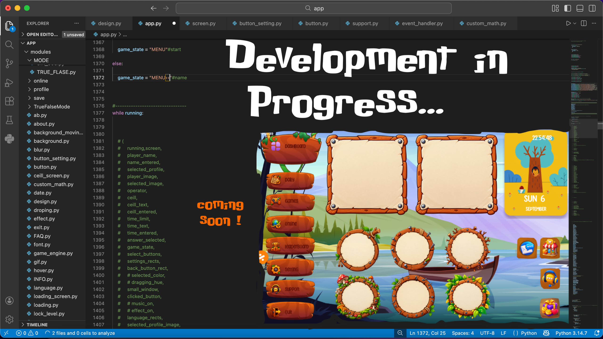

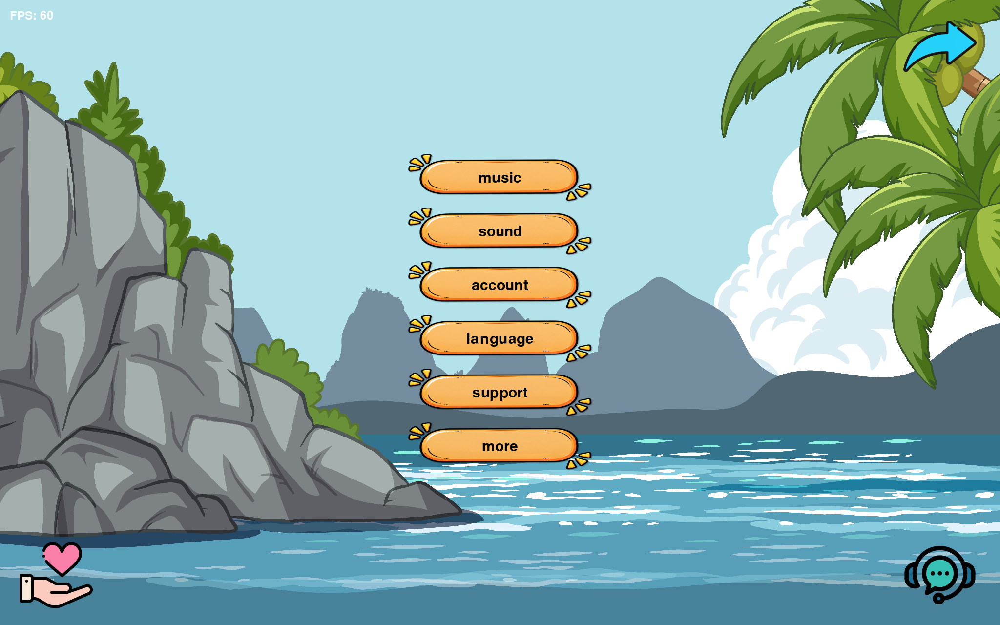

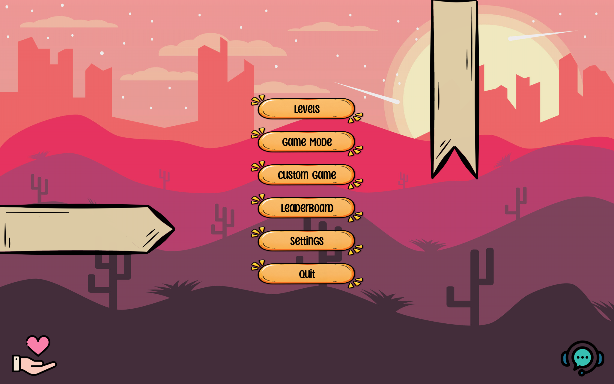

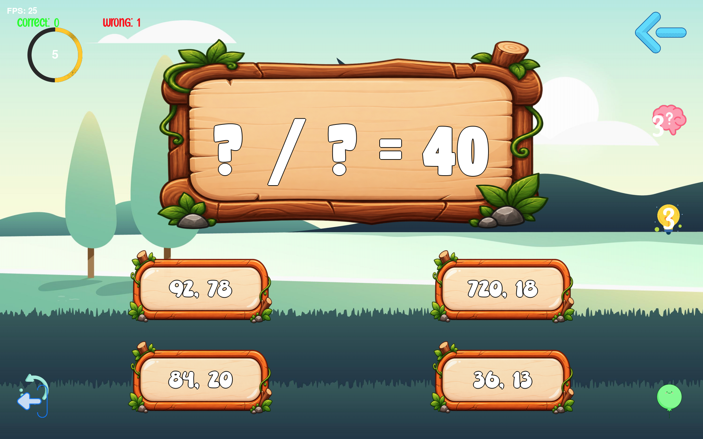

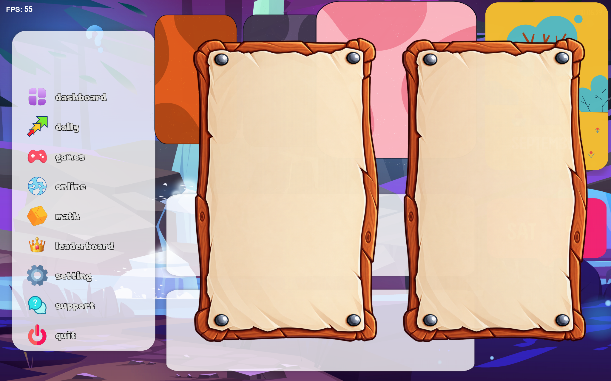

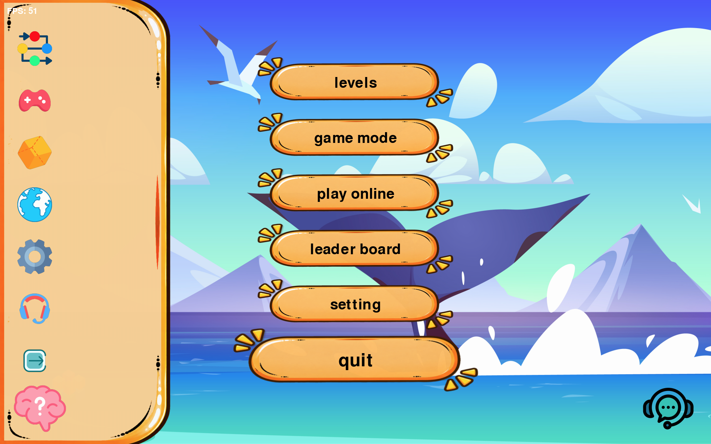

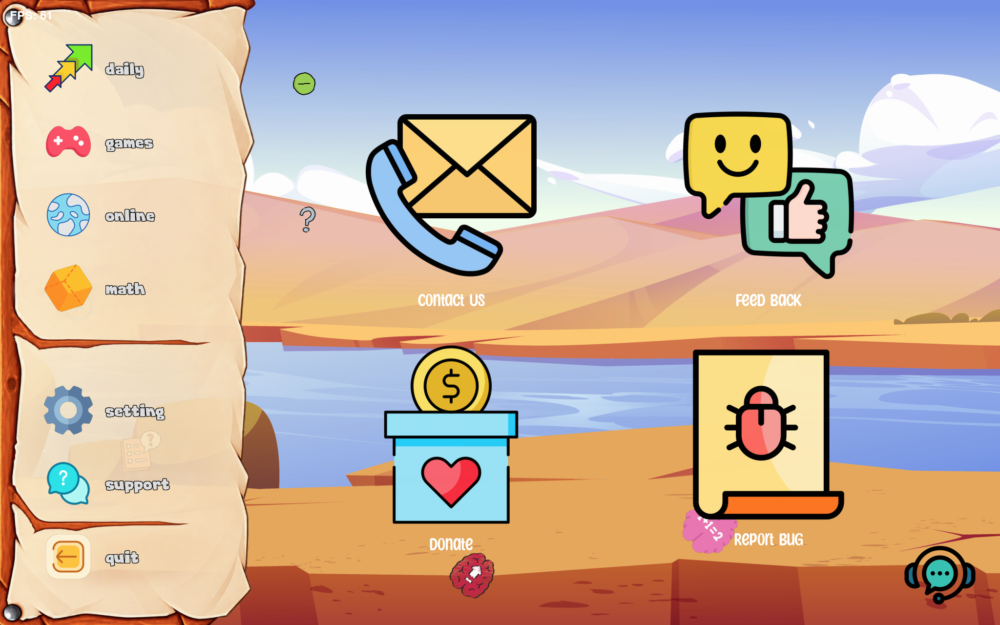

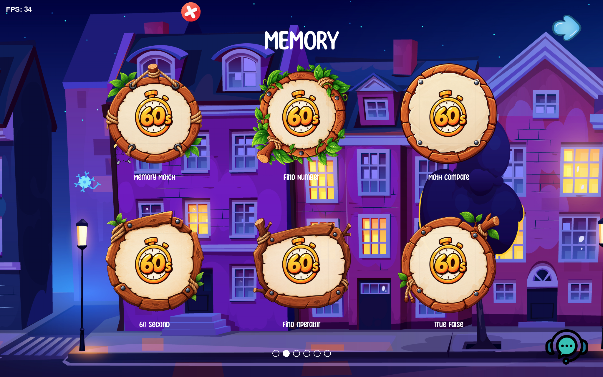

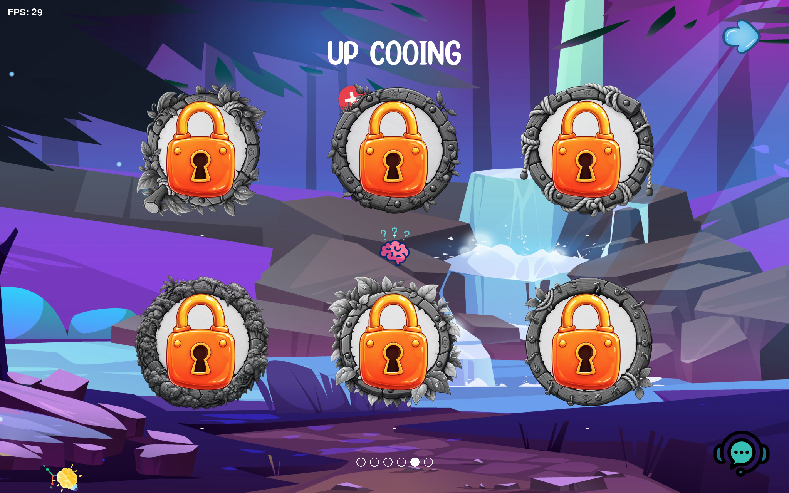

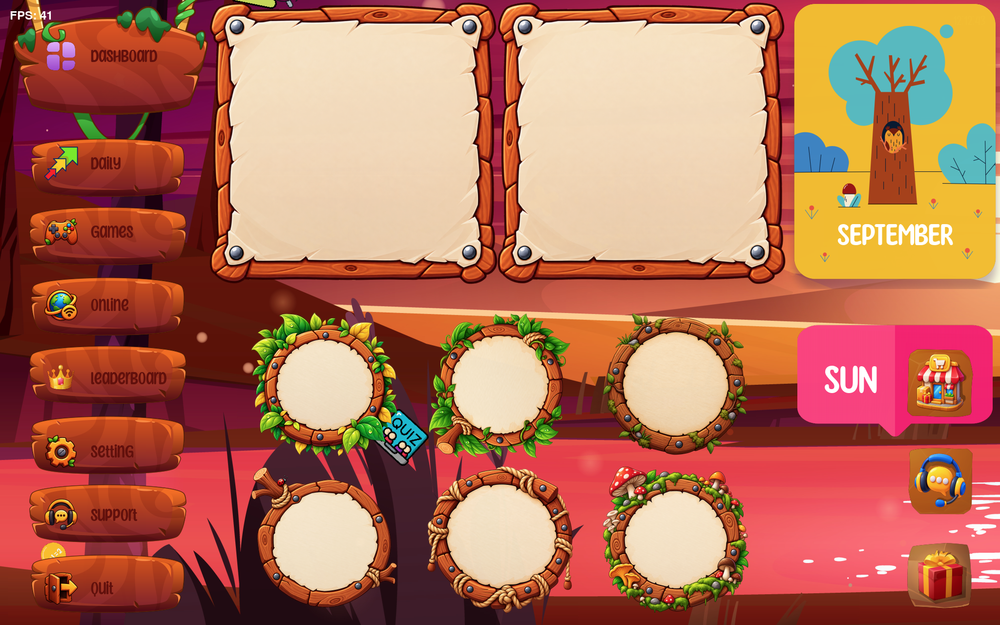

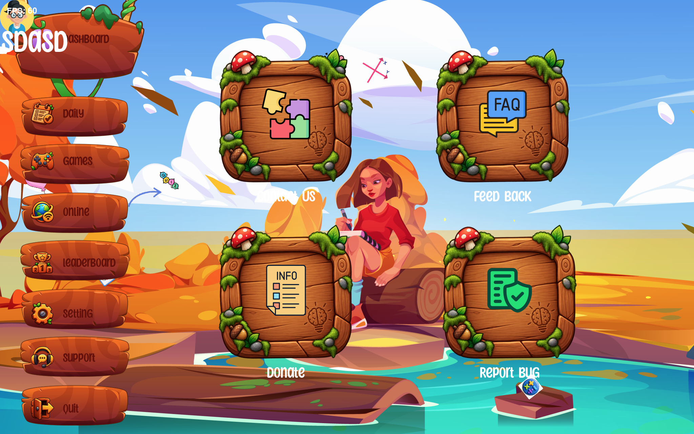

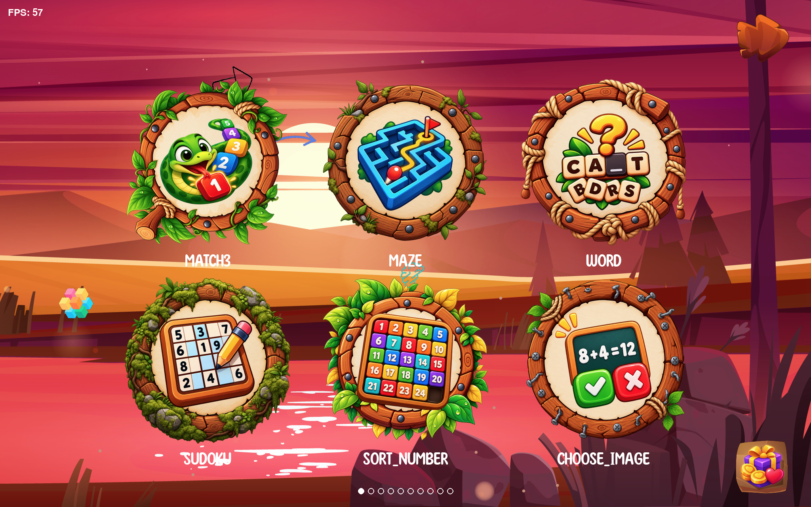

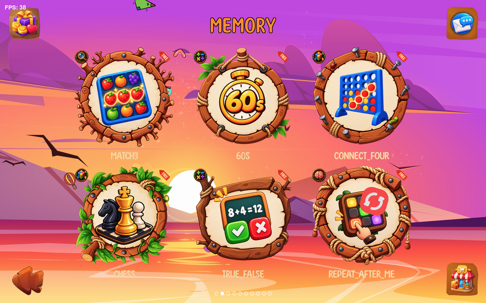

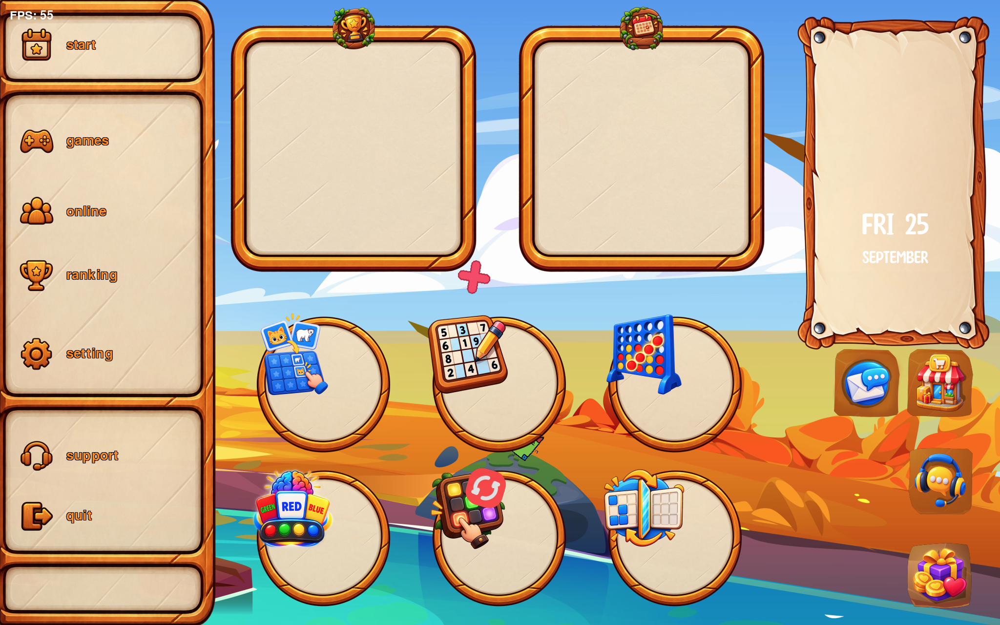

---

# 💻 Initial Release

The first version of **Mental Math Challenge** will initially be released for:

- 🪟 Windows
- 🍎 macOS
- 🐧 Linux

Additional platforms may be supported in future versions.

---

# ✨ Features

- 🎮 20+ brain games
- 🧠 Multiple types of mental challenges
- 🎯 Different difficulty levels
- ⏱️ Timed challenges
- 🏆 Score and record system
- 👤 Player profiles
- 🎨 Custom visual interface
- ✨ Animations and visual effects
- 🔊 Sound effects and music
- 🌍 Multi-language support
- 💾 Local player data
- ⚡ Smooth and responsive gameplay

---

# 🚀 Development Status

The game is currently under active development.

New games, challenges, visual effects, animations, optimizations, and gameplay systems are continuously being added.

---

# 🔮 Future Plans

- 🌐 Online multiplayer
- 🏆 Online leaderboards
- 🎮 More brain games
- 🧠 New challenges
- 🎨 More visual effects
- 🌍 More languages
- 📱 Mobile versions
- 💻 Additional platforms

---

# 🧠 Train Your Brain

**Mental Math Challenge** is built to become a growing collection of brain games that challenge your:

> **Speed • Memory • Accuracy • Concentration • Logic**

More challenges are coming.

---

⭐ **If you like the project, consider giving it a star!**
